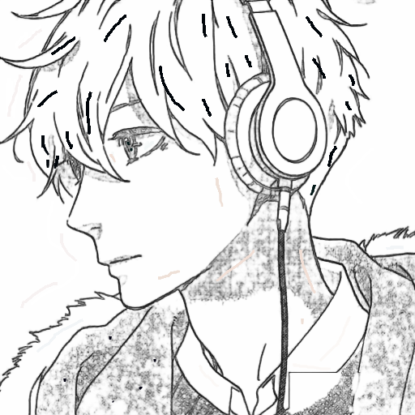

<div align=center></div>

# Anime-Paintbrush

A web-based animation coloring tool, capable of reconstructing sketches into colored images. The uploaded sketch would be preprocessed and some hints about color are needed to provide color information, two parts combining to be put into input. The rendered colorized anime characters will be the output. 

This project is developed with `javascript`, `python`, `css`, etc. The front-end development of this project uses `Vue` with `Element-ui` , with the back-end development using `Django`.


## Table of Contents

- [Background](#background)
- [Install](#install)
- [Usage](#usage)
- [Demonstration](#demonstration)
- [Related Efforts](#related-efforts)
- [Contributor and Maintainer](#contributor-and-maintainer)
- [License](#license)

## Background

As a painting enthusiast, I have tried different ways of painting, such as pen sketching, oil painting, watercolor, etc. The most convenient one is pen sketching, where the basic concern is to outline the object. However, for human perception and the situation where the most applications are currently put, color is essential for drawing.

Thus it is meaningful to design a tool that would **automatically assist in generating high quality images by simply inputing a sketch with a little color cue**. By learning through generative adversarial networks (GAN), neural networks can learn pretty good drawing skills. This project deploys the trained neural network on the back-end, while the front-end is deployed on a web application, and a user-friendly interface is designed so that users can complete the color rendering of sketches and download them through simple operations on the web page.

The goals for this repository are:

1. Provide efficient coloring tools for drawing practitioners to improve drawing efficiency.
2. Provide non-professionals with the opportunity to draw high-quality manga characters at a low learning cost.
3. Provide a reference for programmers since all the code has  been open sourced.

## Install

The back-end is developed with `python3.7`. Make sure you have an available environment. In your environment, install the required packages.

```sh
$ pip install -r requirements.txt
```

This project uses [npm](https://npmjs.com). Go check them out if you don't have them locally installed. Then execute the following commands.

```sh
$ cd frontend
$ npm install --save axios
$ npm install -g @vue/cli
$ npm install
$ npm run build
```

## Usage

Enter the home directory and execute the following commands.

```sh
$ cd Colorization_Tool_on_Web
$ python manage.py runserver
```

At this point, you can already access the page at http://127.0.0.1:8000.

## Demonstration

Demo 1:

<div>&nbsp;&nbsp;</div>
<p>
    &emsp;&emsp;&emsp;&emsp;&emsp;&emsp;Sketch &emsp;&emsp;&emsp;&emsp;&emsp;&emsp;&emsp;&emsp;&emsp;&emsp;&emsp;&emsp;&emsp; Hint &emsp;&emsp;&emsp;&emsp;&emsp;&emsp;&emsp;&emsp;&emsp;&emsp;&emsp;&emsp;&emsp; Result
</p>

Interface:
<div></div>

Demo 2:
<div>&nbsp;&nbsp;</div>
<p>
    &emsp;&emsp;&emsp;&emsp;&emsp;&emsp;Sketch &emsp;&emsp;&emsp;&emsp;&emsp;&emsp;&emsp;&emsp;&emsp;&emsp;&emsp;&emsp;&emsp; Hint &emsp;&emsp;&emsp;&emsp;&emsp;&emsp;&emsp;&emsp;&emsp;&emsp;&emsp;&emsp;&emsp; Result
</p>

Interface:
<div></div>


## Related Efforts

- [Anime-Colorization-Machine](https://github.com/delta6189/Anime-Colorization-Machine) - The checkpoints of the model come from this repo.

## Contributor and Maintainer

[@yangco-le](https://github.com/yangco-le)


## License

[MIT](LICENSE) © Richard Littauer
